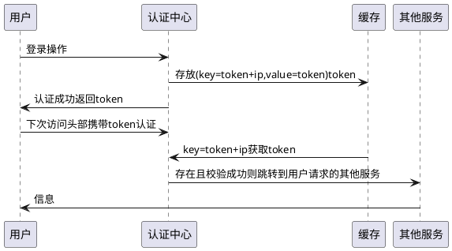
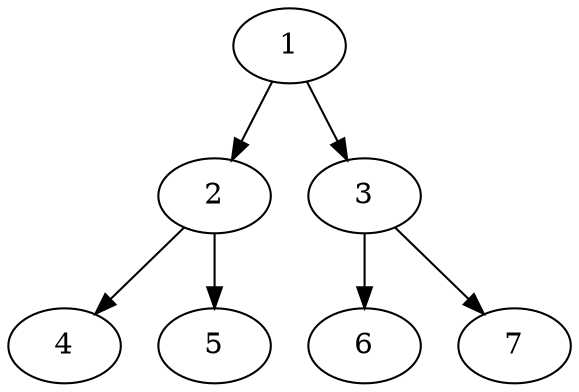

# test

## uml

### plantuml



### dot



### ditaa

```ditaa
+--------+   +-------+    +-------+
|        +---+ ditaa +--> |       |
|  Text  |   +-------+    |diagram|
|Document|   |!magic!|    |       |
|     {d}|   |       |    |       |
+---+----+   +-------+    +-------+
  :                         ^
  |       Lots of work      |
  +-------------------------+
```

### mermaid


### plain

@startuml
用户 -> 认证中心: 登录操作
认证中心 -> 缓存: 存放(key=token+ip,value=token)token

用户 <- 认证中心 : 认证成功返回token
用户 -> 认证中心: 下次访问头部携带token认证
认证中心 <- 缓存: key=token+ip获取token
其他服务 <- 认证中心: 存在且校验成功则跳转到用户请求的其他服务
其他服务 -> 用户: 信息
@enduml

<!-- <script src="mermaid.min.js"></script> -->
<!-- <script>mermaid.initialize({startOnLoad:true});</script> -->