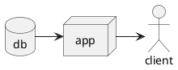
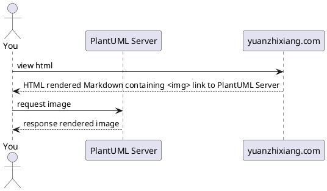

# 如何在 VuePress 中支持用代码渲染 UML

前段时间绘图时使用 plantuml 绘制了一些图片，绘制的图片质量挺好，发现这种绘图的方式很适合博客的场景。几年前写博客时曾使用过静态博客，如果长久坚持写博客并且文章里包含了图片，那么图片会导致仓库体积膨胀到几百兆甚至上 GB，仓库体积膨胀会导致项目难以长久维护。如果改用 plantuml 可以带来下面的好处：

1. 代码能够被 git 管理
2. 绘图时专注在逻辑上，不用关注排版
3. 仓库体积不会过快膨胀

因为有这些好处所以这次改用 VuePress 搭建博客便打算在博客中配置 plantuml，于是有了这篇文章。

## 如何配置

VuePress 底层使用 markdown-it 渲染 markdown 页面，配置 plantuml 实际上就是增加 makrdown-it 插件，支持 plantuml 的插件有很多，这里使用的是 markdown-it-textual-uml 这个插件，下面是配置过程。

先安装 markdown-it-textual-uml 到依赖中

```shell
pnpm add -D markdown-it-textual-uml
```

然后在 VuePress 的配置中增加插件的配置

```typescript
// docs/.vuepress/config.ts
import plantuml from "markdown-it-textual-uml"; 

export default defineUserConfig({
  //...
  extendsMarkdown: (md) => {
    md.use(plantuml);
  },
});
```

到这里就配置完了，```plantuml 代码块中的代码就会被识别为用于绘图的代码，在浏览器运行时将代码替换为图片。[这是本博客配置 plantuml 时候的 MR，其中的代码可供参考。](https://github.com/yuanzhixiang/yuanzhixiang.github.io/pull/14/files)下面是配置后的效果：



## 实现原理

插件实现代码转图片经过了两个过程，在编译 markdown 时会将代码块转成 `` 标签，其中的 src 包含了访问的 PlantUML 服务器的域名，图片格式和 uml 的代码，`https://www.plantuml.com/plantuml/<image type>/<code>`，这其中的 code 是按照一定的编码规则编码后的字符串。当浏览器拿到 `` 后会请求 src 中的地址拿到对应的图片。下面是这篇博客请求 Sequence Diagram 的过程：



## 未来规划

这种实现方式的问题在于页面都经过了三方服务的实时计算，如果三方服务挂了，那么已经发布的服务也会受影响，其次性能也不是很好，比较好的方式是将图片生成放在本地，build 的后的 `` 引用静态文件链接。通过这种实现方式不止能够支持 PlantUML，还可以支持别的扩展，在配置的过程中看见一些别的服务，未来如果有需求都可以考虑接入。这类项目可以从 [asciidoctor](https://docs.asciidoctor.org/diagram-extension/latest/) 中找到。

## 参考文章

- [Vuepress 增加 PlantUML 支持](https://wkii.github.io/Tech/vuepress-add-plantUML-plugin.html)
- [Include diagrams in your Markdown files with Mermaid](https://github.blog/2022-02-14-include-diagrams-markdown-files-mermaid/)
- [diagram-extension](https://docs.asciidoctor.org/diagram-extension/latest/)
- npm repository
  - [markdown-it](https://www.npmjs.com/package/markdown-it)
  - [markdown-it-textual-uml](https://www.npmjs.com/package/markdown-it-textual-uml)
  - [markdown-it-plantuml](https://www.npmjs.com/package/markdown-it-plantuml)
- 可以考虑接入的服务
  - [AsciiToSVG](https://github.com/dhobsd/asciitosvg)
  - BlockDiag
    - [BlockDiag](http://blockdiag.com/en/)
    - [SeqDiag](http://blockdiag.com/en/seqdiag/index.html)
    - [ActDiag](http://blockdiag.com/en/actdiag/index.html)
    - [NwDiag](http://blockdiag.com/en/nwdiag/index.html)
  - [Ditaa](https://ditaa.sourceforge.net/)
  - [Erd](https://github.com/BurntSushi/erd)
  - [GraphViz](https://graphviz.gitlab.io/doc/info/lang.html)
  - [Mermaid](https://github.com/mermaidjs/mermaid.cli)
  - [Mscgen](https://www.mcternan.me.uk/mscgen/)
  - [Shaape](https://github.com/christiangoltz/shaape)
  - [svgbob](https://github.com/ivanceras/svgbob)
  - [Syntrax](https://kevinpt.github.io/syntrax/)
  - [UMLet](https://www.umlet.com/)
  - [Vega](https://vega.github.io/vega/)
  - [Vega-Lite](https://vega.github.io/vega-lite/)
  - [WaveDrom](https://wavedrom.com/)
  - [UMLGraph](https://www.spinellis.gr/umlgraph/)
  - [ariel-diagrams](https://github.com/mermaidjs/ariel-diagrams)